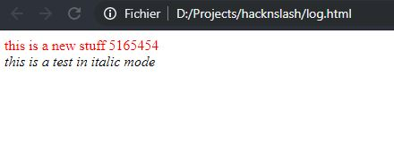

# logging
----
The logging module handles the writting process in a log file in the html format (that allows you to write log with different colors, table... everything you could do with html. The logging file is viewable like any other html file, in a web browser.

**[Available inside src/modules/logging.c](https://github.com/Elkantor/hacknslash/blob/master/src/modules/logging.c)**

Associated data which can be used by this module are inside the **[src/data/data_logging.c file](https://github.com/Elkantor/hacknslash/blob/master/src/data/data_logging.c)**

---

### functions
- <em>[void flush(const char* in_file_name)](#void-flushconst-char-in_file_name)</em>
- <em>[int open(FILE** out_log_file, const char* in_file_name)](#int-logging_openfile-out_log_file-const-char-in_file_name)</em>

---
</br>

#### void flush(const char* in_file_name)

_Clean the content of the logging file_

<u>Example</u>:
```c
    logging.flush("log.html");
```
or by including the associated data_logging.c file:
```c
    logging.flush(data_logging.file_name);
```
***
</br>

#### int open(FILE** out_log_file, const char* in_file_name)

_Open the logging file at the in_file_name name (you can give it the path + the name too)_
_Return 0 if everythings goes well, -1 if an error occured._

<u>Example</u>:
```c
    FILE* my_file;
    logging.open(&my_file, "log.html");
```
or by including the associated data_logging.c file:
```c
    logging.open(data_logging.file, data_logging.file_name);
```
***
</br>

#### int write(FILE** out_log_file, const char* in_color, const char* in_text, ...)

_Write HTML content into the logging file. You can pass a color as a second arg for the text._
_This function uses exactly the same way of passing parameters as <em>printf</em> for example._

<u>Example</u>:
```c
    FILE* my_file;
    logging.open(&my_file, "log.html");
    // write after the file is opened
    logging.write(&my_file, "red", "%s \t %d \t %f", "test", 1, 20.2);
```
or by including the associated data_logging.c file:
```c
    logging.open(data_logging.file, data_logging.file_name);
    logging.write(data_logging.file, "red", "%s \t %d \t %f", "test", 1, 20.2);
```
You can also do something like that, remember, you can write html directly:
```c
    const char* html_content = "<em>this is a test in italic mode</em>";
    logging.open(data_logging.file, data_logging.file_name);
    logging.write(data_logging.file, "black", "%s", html_content);
```

***
</br>

#### void close(FILE** out_log_file)

_Simply close the file (call fclose) whenever you don't require it anymore (in general at the end of the program)._
_You always should call this function when you opened up a file before._

<u>Example</u>:
```c
    FILE* my_file;
    logging.open(&my_file, "log.html");
    logging.write(&my_file, "red", "%s %l", "this is a new stuff", 5165454);
    logging.close(&my_file);
```
or by including the associated data_logging.c file:
```c
    logging.open(data_logging.file, "log.html");
    logging.write(data_logging.file, "red", "%s %l", "this is a new stuff", 5165454);
    logging.close(data_logging.file);
```

***
</br>

## Full example in practice:

```c
    #include "src/modules/logging.c"
    #include "src/data/data_logging.c"

    int main(int argc, char** argv){
        // clear the logging file (by default called log.html as the data_logging.file_name variable)
        logging.flush(data_logging.file_name);
        logging.open(data_logging.file, data_logging.file_name);
        
        logging.write(data_logging.file, "red", "%s %l", "this is a new stuff", 5165454);
        const char* html_content = "<em>this is a test in italic mode</em>";
        logging.write(data_logging.file, "black", "%s", html_content);

        logging.close(data_logging.file);
        return 0;
    }
```

Which gives this result, when you see the log.html file from your web browser:



***