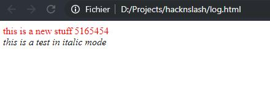

# logging
----
The logging module handles the writting process in a log file in the html format (that allows you to write log with different colors, table... everything you could do with html. The logging file is viewable like any other html file, in a web browser.

**[Available inside src/modules/logging.c](https://github.com/Elkantor/hacknslash/blob/master/src/modules/logging.c)**

Associated data which can be used by this module are inside the **[src/data/data_logging.c file](https://github.com/Elkantor/hacknslash/blob/master/src/data/data_logging.c)**

---

### functions
- <em>void logging_flush(const char* in_file_name)</em>
- <em>int logging_open(const char* in_file_name)</em>
- <em>int logging_write(const char* in_text, ...)</em>
- <em>void logging_close()](#void-closefile-out_log_file)</em>

## Full example in practice:

```c
    #include "src/modules/logging.c"

    int main(int argc, char** argv){
        // clear the logging file (by default called log.html as the data_logging.file_name variable)
        logging_flush(data_logging.file_name);
        logging_open(data_logging.file_name);
        
        logging_write("<div style='color: red;'>%s %ld</div>", "this is a new stuff", 5165454);
        const char* html_content = "<em>this is a test in italic mode</em>";
        logging_write("%s", html_content);

        logging_close();
        return 0;
    }
```

Which gives this result, when you see the log.html file from your web browser:



***
